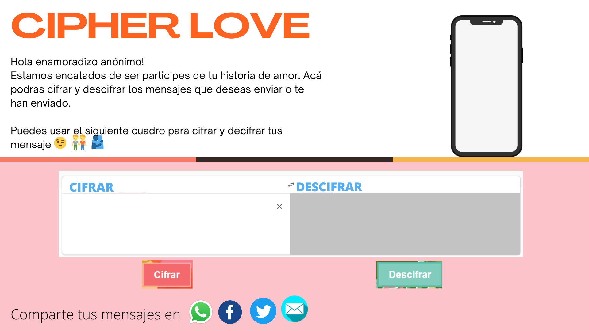

# BIENVENIDO AL REPOSITORIO DE CIPHER SAVELOVE :rainbow:

## Introducción:

Este repositorio fue creado para la realización de un proyecto con fines educativos. Cabe acotar que es el primer prooyecto individual que se realizó con idea cero de lo que es la magia de la programación :computer:.

## Dedicatoria para un mundo sin violencia :green_heart:

#### ¿A quienes está dirigido el proyecto?

Este proyecto está dirigido para lxs personas que son participes de la comunidad LGTBIQ. Quienes aún son marginadxs por su propio entorno y viven con el miedo a ser descubiertos, temor al que dirán y las posibles 'consecuencias' que podrían sufrir en caso desean tomar la opción de ser libres y existe la oposición en su entorno.

#### ¿Cuáles son los objetivos de estos usuarios en relación con tu producto?

Sabemos que hoy en día la comunidad LGTBIQ está siendo más aceptada, ya sea por la misma población y/o diferentes tipos de medios, exigiendo el mismo respeto que merece tener todx ser humano. Pero también sabemos que existe el lado sumamente opuesto, quienes no los aceptan y cometen: desde agresiones verbales y/o físicas, hasta atentados contra la vida humana. Estas últimas declaraciones, son muy tristes. Ninguna persona debería vivir con miedo, y miedo a existir.

## Cipher SaveLove :rainbow:

#### Resolviendo el problema:

'Cipher SaveLove :rainbow:' página web que realizar mensajes cifrados, para que los integrantes de la comunidad que aún viven en perfil bajo, se sientan seguros de poder enviar regalos, mensajes entre otros, delante de todas las personas a la vista. Y que solamente entre ellos, pueda ser entendido, guardando la identidad bajo el mismo cifrado. Siendo participe, de brindar un espacio seguro para la comunidad que aún vive bajo los prejuicios.

## Prototipos de baja fidelidad

###  Primer prototipo:

------------

Head y body:

Footer:

Prototipo en canva (solo head y body):

### Segundo prototipo:

------------

Head y body:

## 9. Checklist

Esta sección está para ayudarte a llevar un control de lo que vas completando.

### Parte Obligatoria

* [ ] `README.md` incluye info sobre proceso y decisiones de diseño.
* [ ] `README.md` explica claramente quiénes son los usuarios y su relación con
  el producto.
* [ ] `README.md` explica claramente cómo el producto soluciona los
  problemas/necesidades de los usuarios.
* [ ] Usa VanillaJS.
* [ ] Implementa `cipher.encode`.
* [ ] Implementa `cipher.decode`.
* [ ] Pasa linter con configuración provista.
* [ ] Pasa pruebas unitarias.
* [ ] Pruebas unitarias cubren 70% de _statements_, _functions_ y _lines_, y un
  mínimo del 50% de _branches_.
* [ ] Interfaz permite elegir el `offset` o _desplazamiento_ a usar en el
  cifrado/descifrado.
* [ ] Interfaz permite escribir un texto para ser cifrado.
* [ ] Interfaz muestra el resultado del cifrado correctamente.
* [ ] Interfaz permite escribir un texto para ser descifrado.
* [ ] Interfaz muestra el resultado del descifrado correctamente.

### Parte Opcional: "Hacker edition"

* [ ] Cifra/descifra minúsculas
* [ ] Cifra/descifra _otros_ caracteres (espacios, puntuación, `ñ`, `á`, ...)
* [ ] Permite usar un `offset` negativo.
